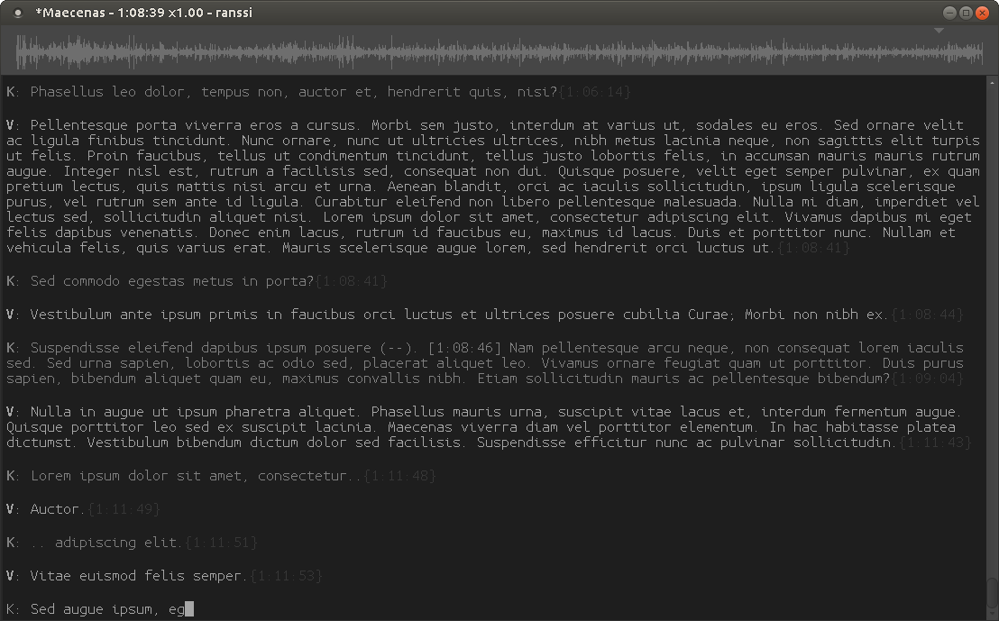

# ranssi
A minimalistic, to-the-point transcription app.

Ranssi originated as a tool I wrote for myself for doing transcription. The repo here represents a rewrite of that tool's codebase.

The project is currently hibernating, but will be woken up at some point.

#### Features
- *(Coming)*
- *(Coming)*
- *(Coming)*

A screenshot of the original ranssi. The rewrite will come to look much like this.

# How to use
*(Coming)*

# Building
*(Coming)*

# Code organization
*(Coming)*

# Project status
*(Coming)*

# Authors and credits
*(Coming)*
